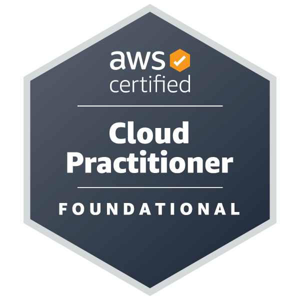
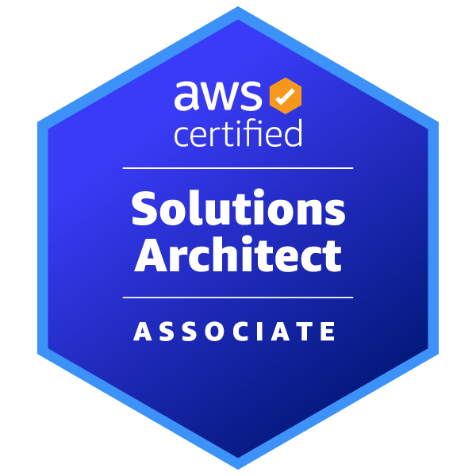

                                                                                  
**ARUN NADH.G**

**ARUNNIVAS**

**BHOOTHAKULAM P.O**

**KOLLAM,KERALA**

**Mobile: +91- 9995855595 9947252354**

**Email: nadh2007@gmail.com**	

**OBJECTIVE**	

  To be a part of the challenging team which strives for the better growth of the organization and which explores my potential and provides me with the opportunity to enhance my talent with an intention to be an asset to the company.
        

**PROFESSIONAL EXPERIENCE**
                
Having 15+ years plus experience in Networking, Cloud, Linux and Windows server Administration.
            
        
**TECHNICAL SKILLS**

Operating Systems	: Windows 10, windows 11, Windows Server 2003, 2008,2016,2019 and 2022,Red-hat Linux, CentOS,Ubuntu, Debian Etc

Remote Tools	:   VNC, Net Meeting, Team Viewer, Any Desk

Database	:   MySQL Server, SQL Server , PostgreSQL , MongoDB etc 

Virtualization	:   Vmware, Proxmox, Hyper V etc

**CERTIFICATIONS** 

RHCE and RHCSA from REDHAT 

MCITP Enterprise Administrator from MICROSOFT

AWS Cloud Practitioner

AWS Certified Solutions Architect - Associate

CERTIFIED ETHICAL HACKER(CEH) 

   
**WORKING EXPERIENCE**	

Date			: Since May 2008 to till the date
Company	: Center for Development of Imaging Technology (CDIT)
Designation 		: System Administrator
Work Location	: THIRUVANANTHAPURAM

**Responsibilities** 

Installs, maintains and troubleshoots various Operating Systems, configures IP addresses, DNS Servers, Mail Servers, Proxy Servers, Web Servers, VPN Servers etc.

Experienced in monitoring administration configuration and troubleshooting of various WAN and LAN Network Components and Devices.

Ensure planned and efficient server support.

Monitoring and Trouble shooting of Windows Servers 2016, 2019, 2022,  Linux servers ,VMware servers ,Database servers etc.

Experienced in monthly Microsoft Hot fixes and Security Updates for all Microsoft Servers.

Trouble shooting of alerts based on criticality for the maximum resolutions by keeping quality of work and escalating to next level in need of higher end trouble shooting.

Creating and pointing of domains using DNS Servers(kerala.gov.in).

Configuring AWS DevOps projects for various government departments.

Hosting and maintenance of Websites and Databases.

Maintaining and managing all the Systems, Servers and Network inside office.

**Technical Proficiency**

**SERVER CONFIGURATION LINUX BASED**

1. Web Server Configuration
2. Dns Server Configuration
3. Dhcp Server Configuration
4. Mail Server Configuration
5. Samba Server
6. Proxy Servers (Squid)
7. Server monitoring using Grafana and Prometheus.
8. IP tables/Firewall Management
9. User Management
10. Logical Volume Management(LVM)
11.GIT+JENKINS 
12.CI/CD
13. Experience in managing Docker and Kubernets Setups
14. Experience in C panel(WHM),Cent Panel,Cyber Panel @ BSD Control Panels

**SERVER CONFIGURATION WINDOWS BASED**

1. Web Server(IIS 7)
2. Active Directory Management(AD)
3. RIS Server Management
4. VPN Server Management
5. Terminal Server Management
6. Exchange Server Management
7. DHCP Server Management

**DATABASE** 

1. MySQL Server
2. PostgreSQL Server
3. MongoDB
4. SQL Server

**VIRTUALIZATION**

1. Vmware 
2. Hyper-V in Windows servers
3. Proxmox

**CLOUD EXPERIENCE**

1.AWS 
2.GCP
3.AZURE

**NETWORKING**

1. LAN WAN networks management
2. Complete understanding of TCP/IP,UDP
3. Network Troubleshooting and Monitoring
4. Basic Cisco Switch and router maintenance
5. Experience in managing SOPHOS  firewall configurations

**PROGRAMMING/SCRIPTING**

1. Intermediate level in programming C,C++
2. Good Knowledge in PHP
3. Knowledge in BASH scripting

**EDUCATIONAL PROFILE**

BE – Computer Science & Engineering from Indian Engineering College    (2007)-63%
Plus 2 Science from GHSS Bhoothakulam(2002)
SSLC from GHSS Bhoothakulam (2000) -72%

**PERSONAL PROFILE**

Father’s Name 	        : Mr.K.Gopinadhan Nair
	
Permanent Address	: “Arunnivas”, Bhoothakulam P.O Kollam,Kerala.-691302.

Phone                   :       0474-2514734 / +91-9947252354

Nationality       	:	Indian

Date of Birth	        :	29-05-1985

Passport No	        :	R7262309 Valid up to – 26/12/2027

Language Proficiency	:	English, Hindi, Malayalam & Tamil.

Strengths		:       Keen to learn, Determined, Flexible, Confident.

